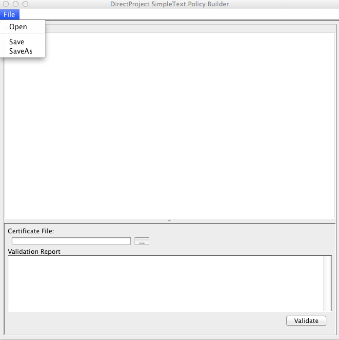
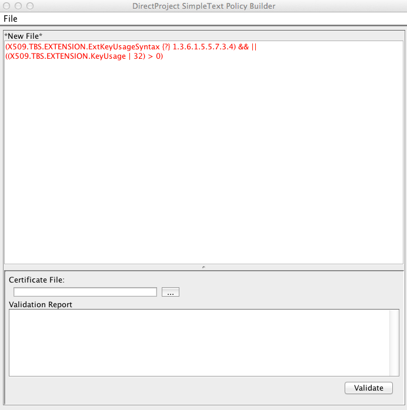
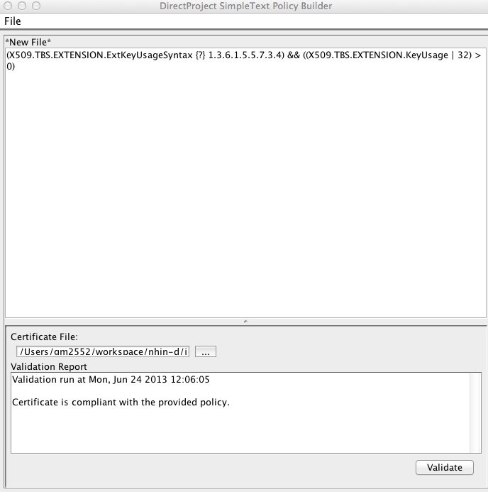
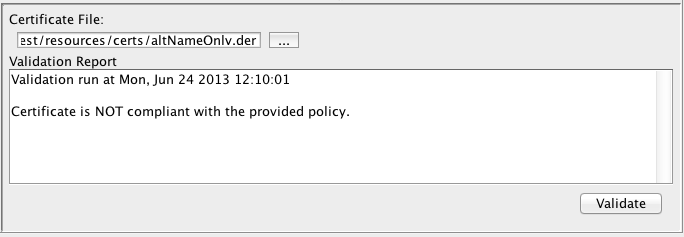
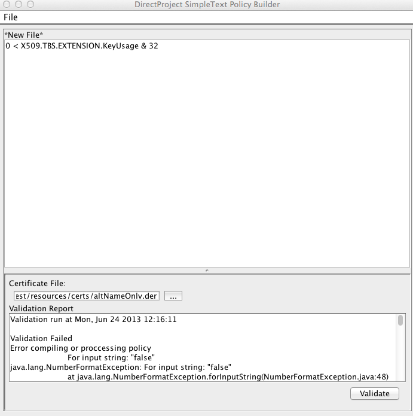

# Policy Builder

The reference implementation source tree provides a tool for building and testing policies. The tool is located under the /java/direct-policy/tools directory in the source tree and is named policyBuilder.sh for unix/linux based systems and policyBuilder.bat for Windows.

The policy builder tool is a simple text editor based tool for creating and testing policies. Policies are written in the Simple Text Lexicon syntax and can be tested against any X509 certificate to validate its use.

To run the tool, run the following command in the /java/direct-policy/tools directory:

Windows:

```
policyBuilder.bat
```

Unix/Linux/MAC

```
./policyBuilder.sh
```

## Policy Editing

Policies are written in the text section in the upper portion of the tool and may either be loaded from an existing file using the File->Open menu option or you may start creating a new policy from scratch. Policies are saved to a file using the File->Save and File->SaveAs menu options.



The tool validates the syntax of you policy in near real time. It indicates if the policy is valid by displaying the text in black and displaying the text in red if the syntax is not valid.

**Valid Syntax Example**


**Invalid Syntax Example**



## Policy Testing

After you have completed editing your policy, you can test it directly against any X509 certificate. To validate and test your policy, simply click the ellipse (...) button to navigate to the certificate file that you wish to test against and click open. Once the certificate is loaded, click the Validate button to test your policy.

There are three possible validation outcomes:

* Certificate is in compliance.

If the policy is valid and the certificate meets all of the criteria of the policy, then the tool will display that the certificate is in compliance with the policy.



* Certificate is not in compliance.

If the policy is valid and the certificate does not meet all of the criteria of the policy, then the tool will display that the certificate is not in compliance with the policy.



* Runtime error

If the policy is syntactically correct but contains logical errors, then the tool will report the error along with a stack trace from the engine. The example below is syntactically correct, but creates a runtime exception because it attempts to perform a logical AND against a boolean operand.

