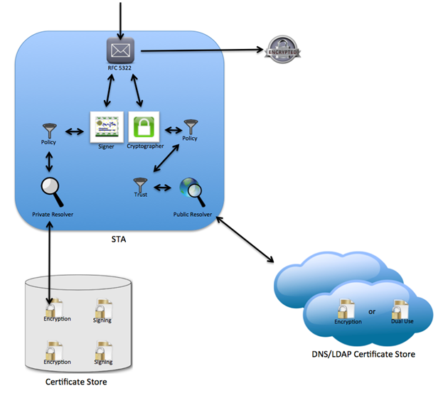
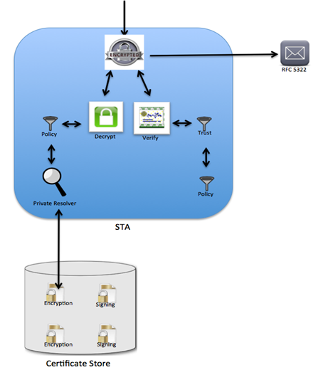

# Security and Trust (STA) Integration and Configuration

## STA Integration

The security and trust agent applies at strategic intercept points policy filters to remove discovered and other encountered certificates that do not meet policy requirements. This allows Direct implementations to enforce specific policy decisions based on regulatory and political needs while remaining backward compatible the underlying transport specification.

Policy filters are applied (if configured) at the following points or the security and trust agent:

*Private Certification Resolution
**Invokes policy decision on the use of certificates for decrypting and message signing.
**Allows for dual use, or separate signing and encryption certificates to be stored in the same certificate store. This provides backwards compatibility with existing certificate storage implementations.
*Public Certification Resolution
**Invokes policy decision on the use of certificates for message encryption. These certificates are generally dynamically discovered over LDAP or DNS.
88Allows for dual use, or separate signing and encryption certificates to be stored in the public certificate storage location. This provides backwards compatibility with existing discovery implementations.
*Signature/Trust Validation
**Invokes policy decisions on the use of certificates extracted from the message signature.
**Allows for dual use, or separate signing and encryption certificates to be encapsulated within the message signature. This provides backwards compatibility with existing message signing implementations.
The following diagrams illustrates the modular layout and flow of messages within the security and trust agent with policy filter included at the appropriate points.

**Outbound Messages**



* Resolved private certificates are validated against a private resolver policy (if configured).
* Resolved public certificates are validated against a public resolver policy (if configured).
* Resolved public certificates are validated against a trust policy (if configured).

**Inbound Messages**



* Resolved private certificates are validated against a private resolver policy (if configured).
* Certificate extracted from the message signature are validated against a public trust policy (if configured).

## STA Configuration

STA configuration consists of two key concepts: policies and policy groups. Policies are simple policy definitions and groups are a collection of policies where each policy is assigned a specific intercept point in the STA process depending on message direct and use. Policies group and then assigned to sender domains. Hierarchically , the constructs are organized accordingly:

```
 + Domain
   |
   |
   - Policy Group
     |
     |
     |
     - Policy: Message Direct and Use 
     - Policy: Message Direct and Use 
     - Policy: Message Direct and Use 
```

Configuration is done through config-manager command line console, but will be available in the config-ui tool in subsequent releases. The config-manager console is distributed with the stock reference implementation assembly. To run the console:

1. Launch a command shell and navigate to the ConfigTools/ConfigMgmtConsole/bin directory.
2. Run the command ConfigMgmtConsole (./ConfigMgmtConsole for unix based systems).
The console connects to the Direct Project configuration service and manages records using the configuration service client module. By default it uses the url http://localhost:8081/config-service/ConfigurationService, but can be overridden using the configURL command line parameter.

```
ConfigMgmtConsole configURL http://confserver/config-service/ConfigurationService
```

The console can either take command directly on the command line or run interactively. If no arguments or commands are passed on the command line (with the exception of the configURL), then console runs interactively. For a list of supported commands, simple type help all either as command line arguments or when running interactively.

**Import Policy**

The first step to configuration is importing your policy definition files. Policies are imported with IMPORTPOLICY command.

```
IMPORTPOLICY
Imports a policy from a file with an optional lexicon definition.
  policyName policyDefFile [lexicon]
	 policyName: Name of the policy.  Place the policy name in quotes ("") if there are spaces in the name.
	 policyDefFile: Fully qualified path and file name of the policy definition file.  Place the file name in quotes ("") if there are spaces in the path or name.
	 [lexicon]: Optional lexicon of the policy definition.  Default to SIMPLE_TEXT_V1 if not supplied.
```

When importing policies, the console validates the definition syntax against the provided or default lexicon (i.e. the definition is parsed). If the definition is not valid, then an error message is displayed and the policy is not imported.

**Add Group**

Before associating policies to a sender's domain, policies are associated to groups and assigned usages. Groups are initially created with the ADDPOLICYGROUP command.

```
ADDPOLICYGROUP
Adds policy group to the system
  groupName 
	 groupName: Name of the policy group.  Place the policy group name in quotes ("") if there are spaces in the name.
```

**Add Policy To Group**

Policy groups are collections of policies, and each policy within the group is assigned a usage which maps to intercept point in the security and trust process. Policies are associate to groups with the ADDPOLICYTOGROUP command.

```
ADDPOLICYTOGROUP
Adds an existing policy to a group with a provided usage.
  policyName groupNames policyUse incoming outgoing
	 policyName: Name of the policy to add to the group.  Place the policy name in quotes ("") if there are spaces in the name.
	 groupName: Name of the policy group to add the policy to.  Place the policy group name in quotes ("") if there are spaces in the name.
	 policyUse: Usage name of the policy in the group.  Must be one of the following values: TRUST, PRIVATE_RESOLVER, PUBLIC_RESOLVER.
	 incoming: Indicates if policy is used for incoming messages.  Must be one of the following values: true, false
	 outgoing: Indicates if policy is used for outgoing messages.  Must be one of the following values: true, false
```

The policyUse in conjunction with the incoming and outgoing parameters maps to the policy to the following points in the security and trust process.


| Policy Use | Direction | Intercept Point |
| --- | --- | --- |
| PUBLIC RESOLVER | Outgoing | Applied when the recipient(s) certificates are discovered via the public certificate resolver. |
| PUBLIC RESOLVER | Incoming	| Applied when the sender's certificates are discovered via the public certificate resolver.
This policy is generally not necessary as certificates are extracted from the message signature and filtered via the TRUST policy use. However, it may be desired to use in conjunction with the TRUST filter to logically separate policies. |
| PRIVATE RESOLVE |	Outgoing | Applied when the sender's certificates are discovered via the private certificate resolver. |
| PRIVATE RESOLVER |	Incoming | Applied when the recipient(s) certificates are discovered via the private certificate resolver. |
| TRUST | Outgoing | Applied after the recipient(s) certificate are validated via certificate path chaining.
This policy is generally not necessary if the outgoing PUBLIC RESOLVER filter is set, however, it may be desired to use in conjunction with the PUBLIC RESOLVER filter to logically separate policies. For example, the PUBLIC RESOLVER may filter based on key usage and TRUST resolver may filter based on policy OIDs. Logically separating policies allows for better reuse of policies for other policy groups. |
| TRUST	|Incoming | Applied after the sender's certificates are validated via certificate path chaining. |

**Add Group To Domain**

The default reference implementation policy resolver applies policies by the sender's domain for outgoing messages and the recipient(s) domain for incoming messages. Policy groups are associated domains with the **ADDPOLICYGROUPTODOMAIN** command.

```
ADDPOLICYGROUPTODOMAIN
Adds an existing policy group to an existing domain.
  groupName domainName
	 groupName: Name of the policy group to add to the domain.  Place the policy group name in quotes ("") if there are spaces in the name.
	 domainName: Name of the domain to add the group to.
```

**Additional Management Commands**

The console supports additional management commands for deleting groups and policies from the system and dis-associating domains, groups, and policies from each other. Use the **help all** command to see a list of all additional commands.